# Infrastructure Setup

## Architecture Summary

- Private VPC subnets only
- No internet gateway and no NAT gateway
- Private EKS API endpoint
- Private managed EKS node group
- ECR Public pull-through cache for the nginx demo image
- VPC endpoints for AWS service access from private subnets
- SSM runner instance for private administrative access
- Kubernetes nginx deployment and private `ClusterIP` service
- CloudWatch log group and CPU alarm for basic observability

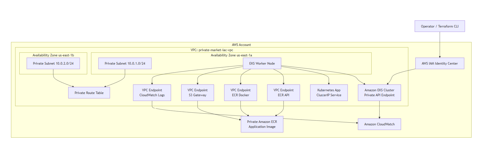

## Deployment Instructions

From the `infra` directory, authenticate with AWS using IAM Identity Center:

```powershell
aws sso login --profile terraform-dev
$env:AWS_PROFILE="terraform-dev"
$env:AWS_SDK_LOAD_CONFIG="1"
```

Initialize and create the AWS infrastructure:

```powershell
terraform init
terraform plan
terraform apply
```

Get the private access details:

```powershell
terraform output ssm_runner_instance_id
terraform output eks_cluster_endpoint
$clusterEndpoint = terraform output -raw eks_cluster_endpoint
$clusterHost = $clusterEndpoint -replace '^https://', ''
```

Open an SSM tunnel to the private EKS endpoint from a second terminal:

```powershell
$clusterEndpoint = terraform output -raw eks_cluster_endpoint
$clusterHost = $clusterEndpoint -replace '^https://', ''
aws ssm start-session `
  --profile terraform-dev `
  --target <ssm_runner_instance_id> `
  --document-name AWS-StartPortForwardingSessionToRemoteHost `
  --parameters "host=$clusterHost,portNumber=443,localPortNumber=8443"
```

Grant your local AWS principal cluster access, then deploy the Kubernetes app through the tunnel:

```powershell
$env:TF_VAR_cluster_admin_principal_arn = "<your_iam_user_or_role_arn>"
terraform apply `
  -var="kubernetes_api_host=https://127.0.0.1:8443" `
  -var="kubernetes_tls_server_name=$clusterHost"

terraform apply `
  -var="deploy_app=true" `
  -var="kubernetes_api_host=https://127.0.0.1:8443" `
  -var="kubernetes_tls_server_name=$clusterHost"
```

Check the private service through the Kubernetes API tunnel:

```powershell
kubectl --server=https://127.0.0.1:8443 --tls-server-name=$clusterHost get pods -n app
kubectl --server=https://127.0.0.1:8443 --tls-server-name=$clusterHost get svc -n app
kubectl --server=https://127.0.0.1:8443 --tls-server-name=$clusterHost `
  -n app port-forward svc/private-market-iac-app 8080:80
```

Then open another terminal:

```powershell
curl http://127.0.0.1:8080
```

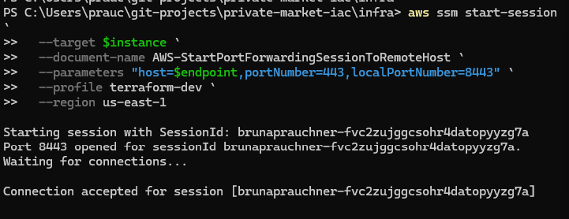

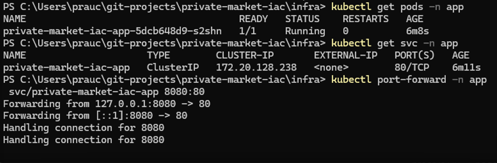

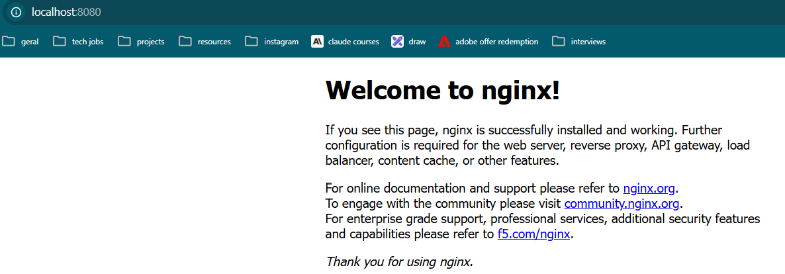

## Clean Up

Destroy the app and infrastructure from the `infra` directory:

```powershell
terraform destroy `
  -var="deploy_app=true" `
  -var="kubernetes_api_host=https://127.0.0.1:8443" `
  -var="kubernetes_tls_server_name=$clusterHost"
```

If the app was deployed with `deploy_app=true`, keep the SSM tunnel open during destroy so the Kubernetes provider can reach the private EKS API and delete the Kubernetes resources cleanly.

## Key Design Decisions

The design keeps the cluster and application private while still allowing the platform to operate without a general internet egress path. Each module owns a small part of that goal:

- `vpc`: Creates private subnets only, with no internet gateway or NAT gateway. AWS service access is handled through VPC endpoints so nodes can reach required AWS APIs without broad outbound internet access.
- `ecr`: Creates the application repository and an ECR Public pull-through cache rule. This lets the private worker nodes pull the nginx demo image through AWS private connectivity instead of reaching public registries directly.
- `ssm-runner`: Provides a private administrative access point through AWS Systems Manager. This avoids inbound SSH and gives Terraform and kubectl a controlled way to reach the private EKS API.
- `eks`: Creates the private EKS cluster and managed node group. The Kubernetes API endpoint is private, worker nodes run in private subnets, and access is granted explicitly through EKS access entries.
- `app`: Deploys the demo nginx service as a Kubernetes deployment and `ClusterIP` service. The service is intentionally not exposed through a public load balancer.
- `observability`: Adds a lightweight CloudWatch baseline with a log group and CPU alarm. This keeps the monitoring scope simple while still showing how the environment would be observed in production.

## Observability

Terraform creates a CloudWatch log group and a basic CloudWatch alarm for EKS node CPU utilization.

```powershell
terraform output observability_log_group
terraform output observability_cpu_alarm
```

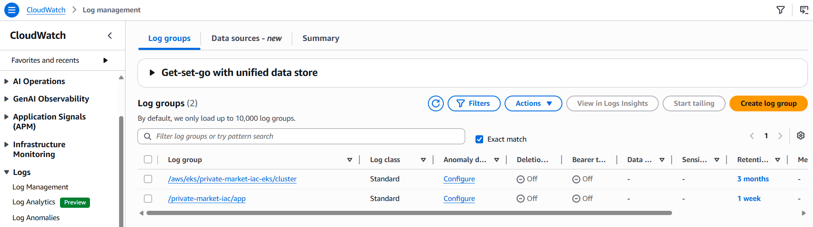

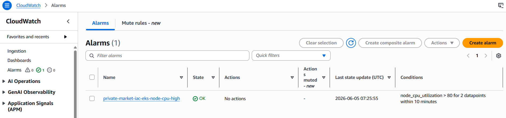

In a production setup, I would extend this with Container Insights or a log forwarder such as Fluent Bit to collect pod and container logs automatically.

## Follow Up Questions

### How would you expose this application to the internet without a public EKS endpoint?

The EKS API endpoint is for cluster administration, not for serving user traffic. I would keep the EKS API private and expose only the application through an internet-facing Application Load Balancer.

The approach would be to use the AWS Load Balancer Controller with a Kubernetes Ingress. The ALB would receive public HTTP/HTTPS traffic and route it privately to the application running in EKS. This keeps cluster administration private while still giving the app a public endpoint. An ALB is a good fit here because it supports path routing, host routing, TLS certificates through ACM, health checks, and optional WAF integration.

### Justify any security decisions or tradeoffs you made during this design.

#### Private by default

The main security decision was to keep the environment private:

- No internet gateway
- No NAT gateway
- Private EKS API endpoint
- Private worker nodes with no public IPs
- Application exposed only as a Kubernetes `ClusterIP` service

This significantly reduces the public attack surface. The tradeoff is that administration is less direct: Terraform and `kubectl` need a private path into the cluster.

#### Administrative access

I used SSM instead of SSH for private administration.

This avoids:

- Opening inbound SSH ports
- Managing bastion host keys
- Exposing the Kubernetes API publicly

The tradeoff is that the SSM runner becomes an important administrative bridge, so its IAM role and security group should be reviewed carefully.

#### Private AWS service access

Because the VPC has no NAT gateway, the cluster still needs a way to reach AWS services. VPC endpoints provide that private connectivity for services such as:

- ECR
- S3
- STS
- SSM
- CloudWatch Logs
- EKS Auth

This keeps required AWS traffic off the public internet, but adds extra infrastructure and cost.

#### Image pull strategy

The design uses an ECR Public pull-through cache so private nodes can pull the nginx demo image through AWS private connectivity.

This fits the assignment because it demonstrates public-image consumption without giving worker nodes general internet egress. In production, I would usually prefer building and pushing a pinned application image into a private ECR repository through CI/CD.

That production approach gives better control over:

- Image origin and build history
- Vulnerability scanning
- Version pinning
- Rollbacks

#### IAM and production improvements

For the assignment, I used AWS-managed policies and kept permissions close to the resources that need them. This keeps the Terraform easier to follow.

In production, I would tighten this further by:

- Replacing broad managed policies with custom least-privilege policies where appropriate
- Reviewing the SSM runner permissions carefully
- Limiting ECR pull-through cache permissions
- Splitting IAM resources into clearer files, such as `modules/eks/iam.tf` and `modules/ssm-runner/iam.tf`

I would keep IAM ownership inside each module rather than creating one large shared IAM module. That keeps the code organized while still making each module responsible for its own permissions.

## Screenshots

### Cluster Networking

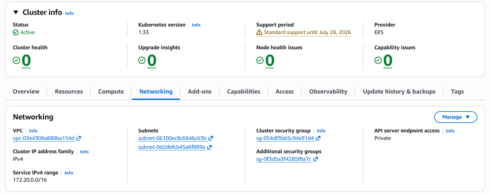

### Private AWS Access

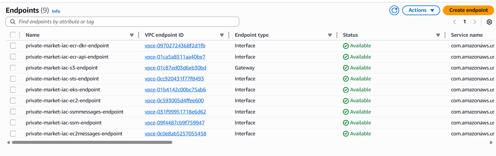

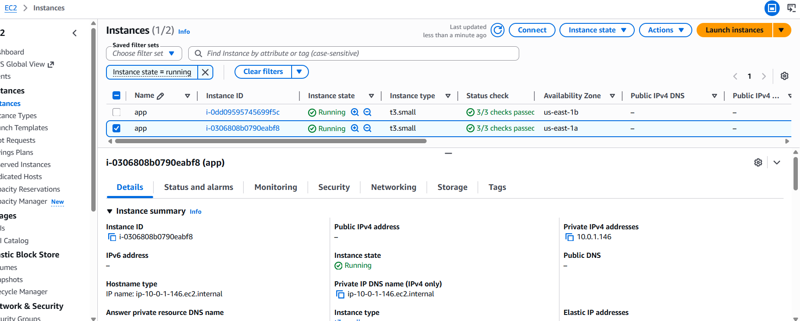

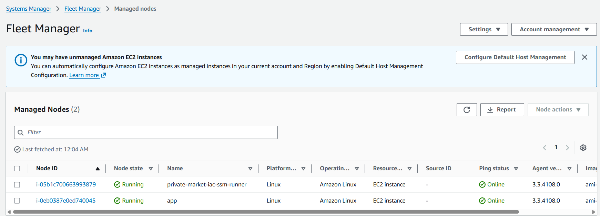

### ECR Pull-Through Cache

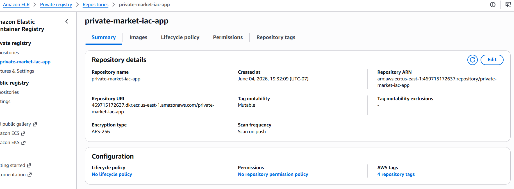
